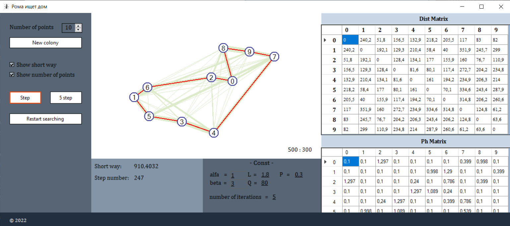

>>>
## Ant colony optimization algorithm

A method of heuristically generating "good solutions" to the **TSP** using a simulation of ACS (ant colony system).

**About:**
https://en.wikipedia.org/wiki/Ant_colony_optimization_algorithms

---

